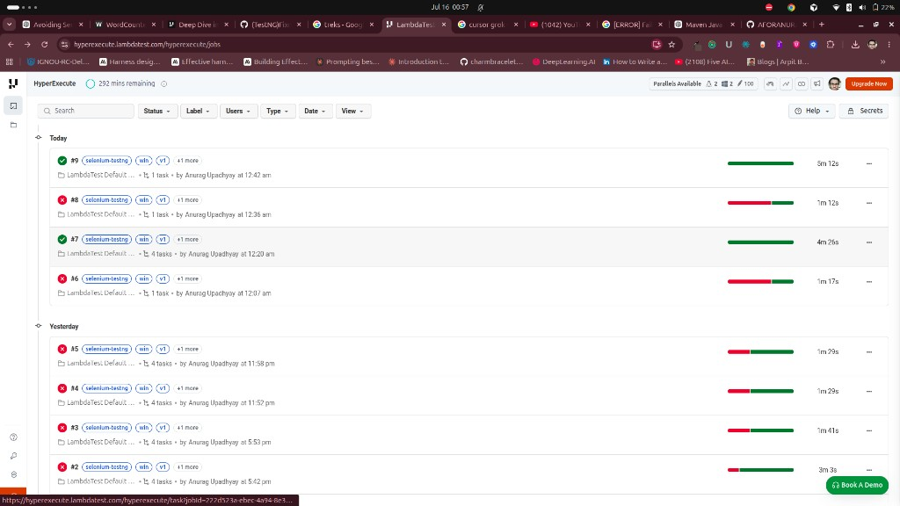
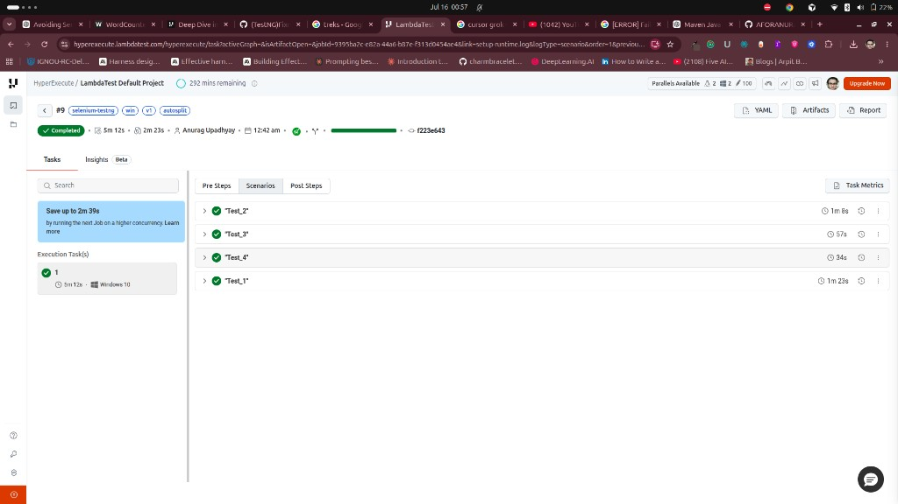

# Task 1: Fix the broken YAML

## Deliverables

| Item | Location |
|---|---|
| Broken YAML (original) | [`testng_hyperexecute_fixme.yaml`](./testng_hyperexecute_fixme.yaml) |
| Corrected YAML | [`testng_hyperexecute_fixme_fixed.yaml`](./testng_hyperexecute_fixme_fixed.yaml) |
| Also kept in repo | `yaml/win/v1/testng_hyperexecute_fixme_fixed.yaml` |
| Evidence screenshots | [`screenshots/`](./screenshots/) |

## Primary documentation used

- [Deep Dive into HyperExecute YAML](https://www.testmuai.com/support/docs/deep-dive-into-hyperexecute-yaml/)
- [Getting Started with HyperExecute](https://www.testmuai.com/support/docs/getting-started-with-hyperexecute/)
- [TestNG on HyperExecute](https://www.testmuai.com/support/docs/testng-on-hyperexecute-grid/)
- Broken gist (assignment source): https://gist.github.com/vishnukdas/20f629efd5747cfbea844996cc4ec658
- Project `pom.xml` (Java 11 compiler settings)

## Successful job evidence

- **Job:** `#9`
- **Status:** Completed
- **Labels:** `selenium-testng`, `win`, `v1`, `autosplit`
- **Duration:** 5m 12s
- **Scenarios passed:** `"Test_1"`, `"Test_2"`, `"Test_3"`, `"Test_4"`
- **Dashboard:** HyperExecute → LambdaTest Default Project → Job #9

### Screenshots






---

## Errors found (beginning → end) and why each broke the job

### 1. `conCurrency: 1` → invalid key name

**Broken**
```yaml
conCurrency: 1
```

**Fixed**
```yaml
concurrency: 1
```

**Why it broke the job:**  
YAML keys are case-sensitive. HyperExecute expects `concurrency`. With `autosplit: true`, concurrency is mandatory. The typo meant the flag was ignored, so autosplit could not allocate/distribute VMs correctly.

**Source:**  
[Deep Dive into HyperExecute YAML → `concurrency`](https://www.testmuai.com/support/docs/deep-dive-into-hyperexecute-yaml/#concurrency) — docs state that if you use the AutoSplit strategy, defining `concurrency` is mandatory.

---

### 2. Invalid `env` YAML syntax

**Broken**
```yaml
env: TOKEN: anvdegtod-asdaasda0asda-asda
```

**Fixed**
```yaml
env:
  TOKEN: anvdegtod-asdaasda0asda-asda
```

**Why it broke the job:**  
`env` must be a nested map. The inline double-mapping is invalid YAML and can fail parsing or prevent environment variables from being injected on the VM.

**Source:**  
[Deep Dive into HyperExecute YAML → `env`](https://www.testmuai.com/support/docs/deep-dive-into-hyperexecute-yaml/#env) — docs show `env` as a nested key/value map, e.g.:

```yaml
env:
  USERNAME: abc
  PLATFORM: windows
```

Also standard YAML mapping rules (a key cannot have two values on the same line like `env: TOKEN: ...`).

---

### 3. Deprecated discovery mode: `dynamic`

**Broken**
```yaml
testDiscovery:
  mode: dynamic
```

**Fixed**
```yaml
testDiscovery:
  mode: local
```

**Why it broke the job:**  
`dynamic` is deprecated. Supported modes are `local` and `remote`. Using a deprecated mode risks unreliable discovery/orchestration behavior.

**Source:**  
[Deep Dive into HyperExecute YAML → `testDiscovery` → `mode`](https://www.testmuai.com/support/docs/deep-dive-into-hyperexecute-yaml/#mode) — docs note:

> The earlier `dynamic` discovery mode has been deprecated. Use `remote` instead for all new and existing YAML configurations.

Supported values shown in docs: `mode: local` or `mode: remote`.  
For autosplit orchestration, docs also note test orchestration works with `mode: local`.

---

### 4. Leading space before `retryOnFailure`

**Broken**
```yaml
 retryOnFailure: true
```

**Fixed**
```yaml
retryOnFailure: true
```

**Why it broke the job:**  
The leading space made this an incorrectly indented / invalid top-level key, so retry config might not apply as intended.

**Source:**  
- [Deep Dive into HyperExecute YAML → `retryOnFailure`](https://www.testmuai.com/support/docs/deep-dive-into-hyperexecute-yaml/#retryonfailure) — expects a top-level boolean flag.
- YAML indentation rules: leading whitespace changes key hierarchy / can make the key invalid at root level.

---

### 5. `dependency:resolve` mixed into `testRunnerCommand`

**Broken**
```yaml
testRunnerCommand: mvn test `-Dplatname=win `-Dmaven.repo.local=./.m2 dependency:resolve `-DselectedTests=$test
```

**Fixed**
```yaml
testRunnerCommand: mvn test `-Dplatname=win `-Dmaven.repo.local=./.m2 `-DselectedTests=$test
```

**Why it broke the job:**  
Dependency resolution belongs in `pre`. Mixing `dependency:resolve` into the per-test runner command makes the Maven invocation messy and can interfere with clean test execution. PowerShell backticks around `-D...` were kept (required on Windows).

**Source:**  
- [Deep Dive into HyperExecute YAML → `pre`](https://www.testmuai.com/support/docs/deep-dive-into-hyperexecute-yaml/#pre) — `pre` is for install/setup commands like `mvn install` / dependency setup before each test execution.
- [Deep Dive into HyperExecute YAML → `testRunnerCommand`](https://www.testmuai.com/support/docs/deep-dive-into-hyperexecute-yaml/#testrunnercommand) — used to run a **single test entity** in isolation (not dependency install).
- Windows PowerShell backtick pattern is used in official HyperExecute Windows / hybrid YAML examples in the same docs (platform-specific `testRunnerCommand` examples escape `-D` flags with backticks).

---

### 6. Missing `runtime: java 11` (required for this project)

**Broken:** no `runtime` block

**Fixed**
```yaml
runtime:
  language: java
  version: 11
```

**Why it broke the job:**  
`pom.xml` sets `maven.compiler.source/target` to **11**. Without provisioning Java 11 on the HyperExecute Windows VM, Maven failed at `testCompile` with:

```text
Fatal error compiling: invalid target release: 11
```

So tests never reached Selenium — compilation failed first. Adding `runtime` installs Java 11 on the VM and unblocks the job.

**Source:**  
- [Deep Dive into HyperExecute YAML → `runtime`](https://www.testmuai.com/support/docs/deep-dive-into-hyperexecute-yaml/#runtime) — used to download/install the language/version needed to execute tests (supports `java`, etc.).
- Project evidence: root `pom.xml` (`maven.compiler.source/target` = 11) + HyperExecute stage logs showing `invalid target release: 11` before `runtime` was added; job succeeded after adding it (Job #9).

---

## Corrected YAML (final)

```yaml
---
version: 0.1
runson: win

autosplit: true
concurrency: 1

runtime:
  language: java
  version: 11

env:
  TOKEN: anvdegtod-asdaasda0asda-asda

pre:
  - mvn dependency:resolve

testDiscovery:
  type: raw
  mode: local
  command: grep 'test name' xml/testng_win.xml | awk '{print$2}' | sed 's/name=//g' | sed 's/\x3e//g'

testRunnerCommand: mvn test `-Dplatname=win `-Dmaven.repo.local=./.m2 `-DselectedTests=$test

retryOnFailure: true
maxRetries: 1

jobLabel: [selenium-testng, win, v1, autosplit]
```

## How to re-run

```bash
export LT_USERNAME="YOUR_USERNAME"
export LT_ACCESS_KEY="YOUR_ACCESS_KEY"
./hyperexecute --config yaml/win/v1/testng_hyperexecute_fixme_fixed.yaml --force-clean-artifacts --download-artifacts
```
