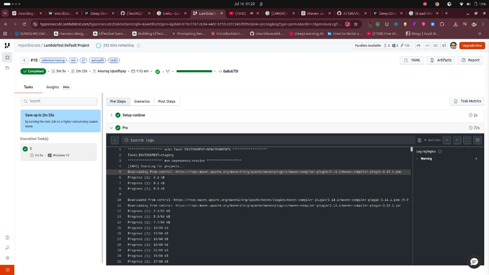
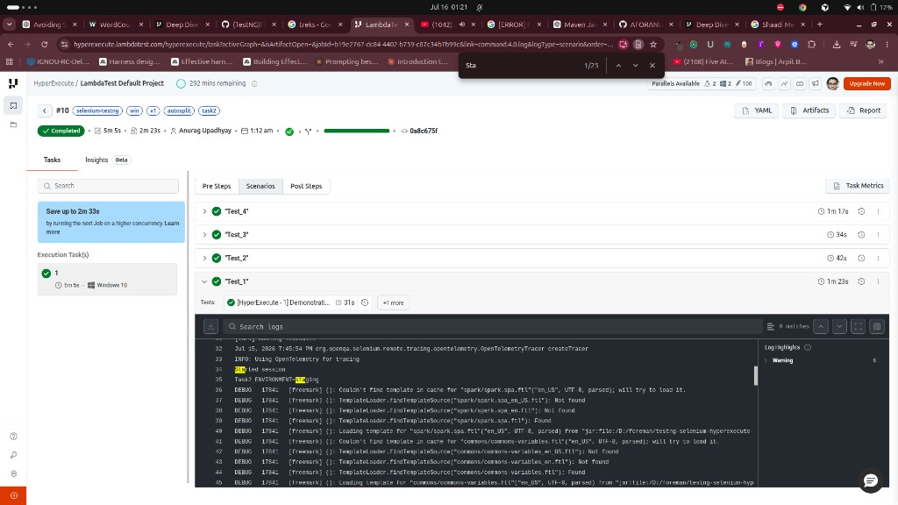

# Task 2: Environment variables

## What this task asks

Extend the fixed YAML from Task 1 to:

1. Define at least one custom environment variable in the YAML (e.g. `ENVIRONMENT: staging`)
2. Print that value in **pre** steps (visible in HyperExecute job logs)
3. Read the same variable inside a test case and print it during test execution

**Source (assignment):** `HyperExecute_SE_Assignment.pdf` → Task 2  
**YAML `env` docs:** [Deep Dive into HyperExecute YAML → env](https://www.testmuai.com/support/docs/deep-dive-into-hyperexecute-yaml/#env)

---

## Deliverables

| Item | Location |
|---|---|
| Updated YAML | [`testng_hyperexecute_task2.yaml`](./testng_hyperexecute_task2.yaml) / `yaml/win/v1/testng_hyperexecute_task2.yaml` |
| Test code change | `src/test/java/Test1.java` (`test1_element_addition_1`) |
| Log evidence (pre + test) | [`screenshots/`](./screenshots/) |

## Successful job evidence

- **Job:** `#10`
- **Status:** Completed
- **Labels:** `selenium-testng`, `win`, `v1`, `autosplit`, `task2`
- **Duration:** 5m 5s
- **OS:** Windows 10

### Screenshots

**Pre steps** — env var printed before tests:



**Test execution** — same env var printed from Java in `"Test_1"`:



---

## What we changed (step by step)

### 1. Define custom env var in YAML

```yaml
env:
  TOKEN: anvdegtod-asdaasda0asda-asda
  ENVIRONMENT: staging
```

HyperExecute injects these into the Windows VM before `pre` / tests run, so both shell and Java can read `ENVIRONMENT`.

**Source:** [Deep Dive into HyperExecute YAML → `env`](https://www.testmuai.com/support/docs/deep-dive-into-hyperexecute-yaml/#env)

### 2. Print it in `pre` steps

```yaml
pre:
  - echo Task2_ENVIRONMENT=%ENVIRONMENT%
  - mvn dependency:resolve
```

On Windows, HyperExecute docs commonly expand env vars with `%VAR%` in `pre` commands  
([tunnel / env examples in YAML deep dive](https://www.testmuai.com/support/docs/deep-dive-into-hyperexecute-yaml/#tunnelopts)).

**Observed in Job #10 Pre Steps log:**

```text
Task2_ENVIRONMENT=staging
```

### 3. Read it inside a test case

In `Test1.test1_element_addition_1`:

```java
String environment = System.getenv("ENVIRONMENT");
System.out.println("Task2_ENVIRONMENT=" + environment);
```

**Observed in Job #10 `"Test_1"` scenario log:**

```text
Task2_ENVIRONMENT=staging
```

---

## How to re-run

```bash
export LT_USERNAME="YOUR_USERNAME"
export LT_ACCESS_KEY="YOUR_ACCESS_KEY"
./hyperexecute --config yaml/win/v1/testng_hyperexecute_task2.yaml --force-clean-artifacts --download-artifacts --download-logs
```

---

## Evidence checklist

- [x] Pre-step log shows `Task2_ENVIRONMENT=staging`
- [x] Test log shows `Task2_ENVIRONMENT=staging`
- [x] Screenshots saved under `screenshots/`
