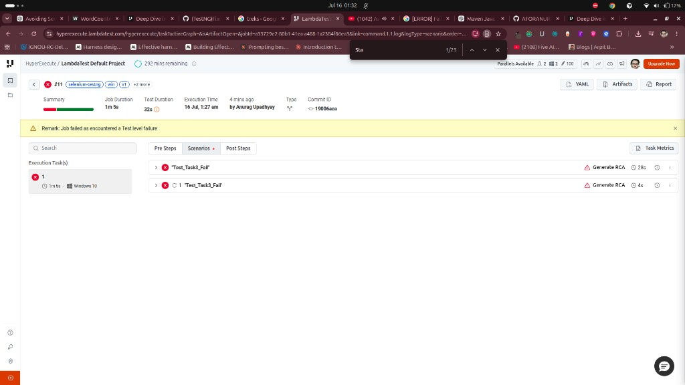
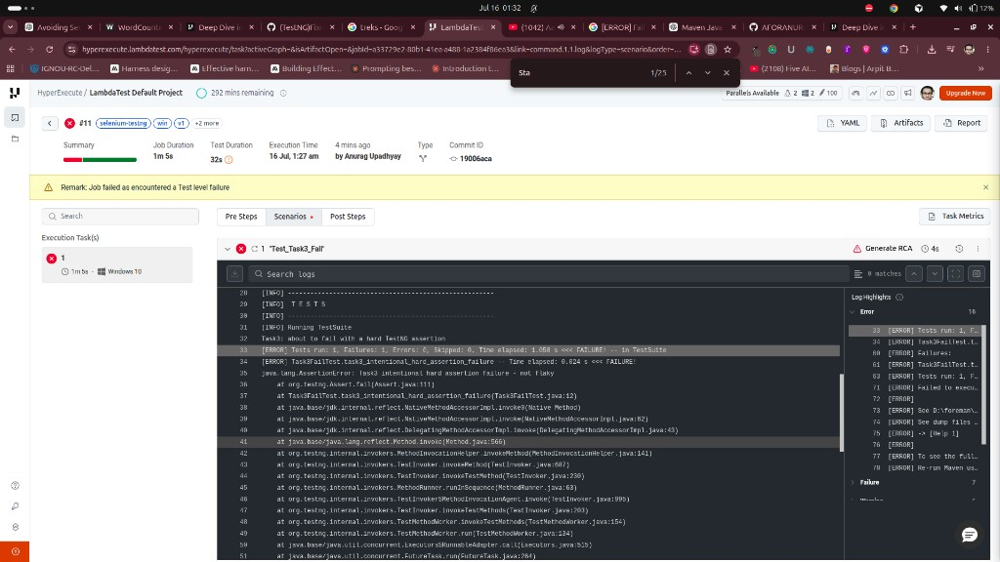

# Task 3: Force a failure and configure retries

## What this task asks

1. Modify or add a test that **explicitly fails** (hard assertion, not flaky)
2. Configure `retryOnFailure` in YAML so the failing test is retried
3. Confirm from logs/dashboard that the retry happened

**Source (assignment):** `HyperExecute_SE_Assignment.pdf` → Task 3  
**Retry docs:** [Deep Dive into HyperExecute YAML → `retryOnFailure`](https://www.testmuai.com/support/docs/deep-dive-into-hyperexecute-yaml/#retryonfailure)  
**maxRetries docs:** [Deep Dive into HyperExecute YAML → `maxRetries`](https://www.testmuai.com/support/docs/deep-dive-into-hyperexecute-yaml/#maxretries)

---

## Deliverables

| Item | Location |
|---|---|
| Intentional fail test | `src/test/java/Task3FailTest.java` |
| Suite entry | `xml/testng_win.xml` → `Test_Task3_Fail` |
| YAML retries | [`testng_hyperexecute_task3.yaml`](./testng_hyperexecute_task3.yaml) |
| Retry evidence | [`screenshots/`](./screenshots/) |

## Successful evidence (retry confirmed)

- **Job:** `#11`
- **Status:** FAILED (expected — assertion always fails)
- **Remark:** Job failed as encountered a Test level failure
- **Labels:** `selenium-testng`, `win`, `v1`, … `task3`
- **Duration:** 1m 5s

### Proof that retry ran

Scenarios tab shows **`"Test_Task3_Fail"` twice**:

| Attempt | Duration | Meaning |
|---|---|---|
| 1st `"Test_Task3_Fail"` | ~28s | Original failure |
| 2nd `"Test_Task3_Fail"` | ~4s | HyperExecute `{retry 1}` |

That second scenario is the automatic retry from:

```yaml
retryOnFailure: true
maxRetries: 1
```

### Screenshots





**Log excerpt (hard assertion):**

```text
Task3: about to fail with a hard TestNG assertion
[ERROR] Task3FailTest.task3_intentional_hard_assertion_failure ... <<< FAILURE!
java.lang.AssertionError: Task3 intentional hard assertion failure - not flaky
```

---

## 1. Hard assertion failure (test code)

```java
@Test(description = "Task 3 intentional hard assertion failure")
public void task3_intentional_hard_assertion_failure() {
    System.out.println("Task3: about to fail with a hard TestNG assertion");
    Assert.fail("Task3 intentional hard assertion failure - not flaky");
}
```

Suite wiring in `xml/testng_win.xml`:

```xml
<test name="Test_Task3_Fail">
  <classes>
    <class name="Task3FailTest" />
  </classes>
</test>
```

---

## 2. YAML retry section

```yaml
retryOnFailure: true
maxRetries: 1
```

**Why this works:** HyperExecute retries when the **`testRunnerCommand` itself fails** (non-zero exit).  
A failed TestNG assertion makes Maven Surefire fail `mvn test`, which triggers the retry.

**Source:** [retryOnFailure docs](https://www.testmuai.com/support/docs/deep-dive-into-hyperexecute-yaml/#retryonfailure) — retries trigger only if the test command fails; not if the command exits success and status is marked failed only via hooks.

---

## How to re-run

```bash
export LT_USERNAME="YOUR_USERNAME"
export LT_ACCESS_KEY="YOUR_ACCESS_KEY"
./hyperexecute --config yaml/win/v1/testng_hyperexecute_task3.yaml --force-clean-artifacts --download-artifacts --download-logs
```

---

## Evidence checklist

- [x] Test code shows intentional `Assert.fail(...)`
- [x] YAML has `retryOnFailure: true` + `maxRetries: 1`
- [x] Dashboard shows `"Test_Task3_Fail"` twice (attempt + retry) on Job #11
